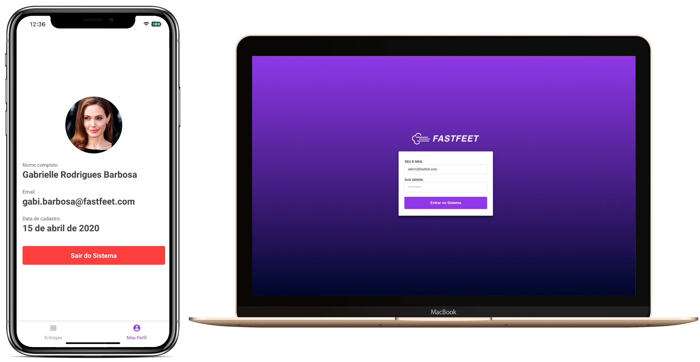
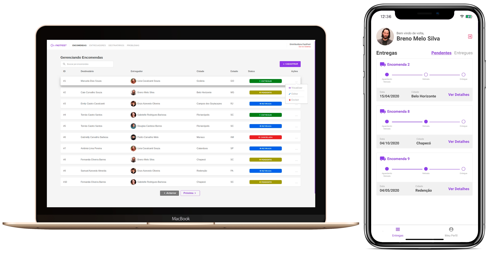

<h1 align="center">
  
</h1>

<h4 align = "center">
  Serviço para gestão e acompanhamento de encomendas
</h4>

<p align="center">
  
  
  
  
  

  <a href="https://github.com/leeonardovargas/gobarber/commits/master">
    
  </a>
  
  <a href="https://github.com/leeonardovargas/gobarber/issues">
    
  </a>
  
  
</p>

<p align="center">
  <a href="#rocket-tecnologias">Tecnologias</a>&nbsp;&nbsp;&nbsp;|&nbsp;&nbsp;&nbsp;
  <a href="#-projeto">Projeto</a>&nbsp;&nbsp;&nbsp;|&nbsp;&nbsp;&nbsp;
  <a href="#-instalação-e-execução">Instalação e execução</a>&nbsp;&nbsp;&nbsp;|&nbsp;&nbsp;&nbsp;
  <a href="#-licença">Licença</a>
</p>

<p align="center">
  
</p>

<p align="center">
  
</p>


## :rocket: Tecnologias

-  [Node.js](https://nodejs.org/en/)
-  [Docker](https://docs.docker.com/)
-  [React](https://pt-br.reactjs.org/)
-  [Redux](https://redux.js.org/)
-  [Redux-Saga](https://redux-saga.js.org/)
-  [React-Toastify](https://fkhadra.github.io/react-toastify/)
-  [Styled-components](https://www.styled-components.com/)
-  [Unform](https://unform.dev/)
-  [React-Icons](https://react-icons.netlify.com/)
-  [Yup](https://github.com/jquense/yup)
-  [Date-fns](https://date-fns.org/)
-  [React Native](https://reactnative.dev/)
-  [React Navigation v5](https://reactnavigation.org/)
-  [React-Native-Vector-Icons](https://oblador.github.io/react-native-vector-icons/)
-  [ESLint](https://eslint.org/)

## 💻 Projeto

Neste projeto você vai encontrar uma aplicação completa, contendo a API REST(**Back-end**), versão WEB (**Front-end**) e versão para dispositivos móveis(**Mobile**). O FastFeet faz parte do desafio final do Bootcamp GoStack da <a target="_blank" href="https://rocketseat.com.br/">Rocketseat</a>.


## 📥 Instalação e execução

Faça um clone desse repositório e acesse o diretório

```bash
$ git clone https://github.com/LeeonardoVargas/fast-feet.git && cd fast-feet
```

### Backend


```bash
# Acessar diretório 
$ cd backend/
```

Crie ou acesse uma conta no [MailTrap](https://mailtrap.io/), após isso insira suas credenciais no arquivo `.env.example`

```
MAIL_USER=
MAIL_PASS=
```

Renomei o arquivo `.env.example` para `.env` e execute os seguintes comandos:

```bash
# Criando container Postgres 
$ docker run --name postgres-fastfeet -e POSTGRES_PASSWORD=docker -p 5432:5432 -d postgres

# Criando database fastfeet no container postgres-fastfeet  
$ docker exec -it postgres-fastfeet psql -h localhost -U postgres -c "CREATE DATABASE fastfeet"

# Criando container Redis 
$ docker run --name redis-fastfeet -p 6379:6379 -d -t redis:alpine

# Executando o migrate e os seeds 
$ yarn sequelize db:migrate && yarn sequelize db:seed:all

# Execute o shell script 
$ sh init.sh

```

Abra outra janela/aba do terminal para executar o [Bee-Queue](https://github.com/bee-queue/bee-queue).

> Responsável por gerenciar as filas/jobs dentro do nodeJS, com o auxílio do [Redis](https://redis.io/). Otimizando assim o envio de email.

```bash
$ yarn queue
```

> **Importando Request:** Durante o desenvolvimento da API REST foi utilizado o [Insomnia](https://insomnia.rest/) para testar os retornos das rotas, caso queira usar o mesmo, foi exportado o arquivo **insomnia-data.json** com todos os request já criados.

### Frontend

```bash
# Acessar diretório 
$ cd frontend/

# Execute o shell script 
$ sh init.sh

```

Ao acessar a url **http://localhost:3000** insira as seguintes credenciais para o login:

```
Email: admin@fastfeet.com
Senha: abacaxi
```


### Mobile

> **Importante:** Para testar a aplicação mobile foi utilizado o emulador Android [Genymotion](https://www.genymotion.com/).

```bash
# Acessar diretório 
$ cd mobile/

# Instalando as depedências
$ yarn install

# Gerando o app no emulador
$ react-native run-android
```

Caso as imagens dos avatares não estejam sendo carregadas rode o seguinte comando:

```bash
# Configurando um "proxy reverso" no servidor http, permitindo o acesso
$ adb reverse tcp:3333 tcp:3333
```

## :muscle: Contribuir

Como seres humanos todos nós somos tolerantes a falhas, então se você notar algum erro ou tenha alguma sugestão sobre o projeto, eu ficarei feliz com a sua contribuição, então faça o `fork` e clone o projeto a partir do seu usuário.

```bash
$ git clone https://github.com/SEU-NOME-DE-USUARIO/fast-feet.git
```
Gere uma nova ramificação do projeto, no exemplo a seguir vou chamar o branch de `minha-alteracao`, mas você pode dar o nome que quiser.

```bash
# Criando um branch
$ git branch minha-alteracao
# Acessando o novo branch
$ git checkout minha-alteracao
```

Faça as alterações necessárias e o push para a branch.

```bash
# Adicionando os arquivos alterados
$ git add .
# Mensagem do commit
$ git commit -m "Corrigindo...."
# Enviando alterações para o brach
$ git push --set-upstream origin minha-alteracao
```
Por último, você deve navegar até o seu repositório onde fez o fork e pressionar o botão *New pull request* no lado esquerdo da página.

## 📝 Licença

Esse projeto está sob a licença MIT. Veja o arquivo [LICENSE](LICENSE.md) para mais detalhes.
